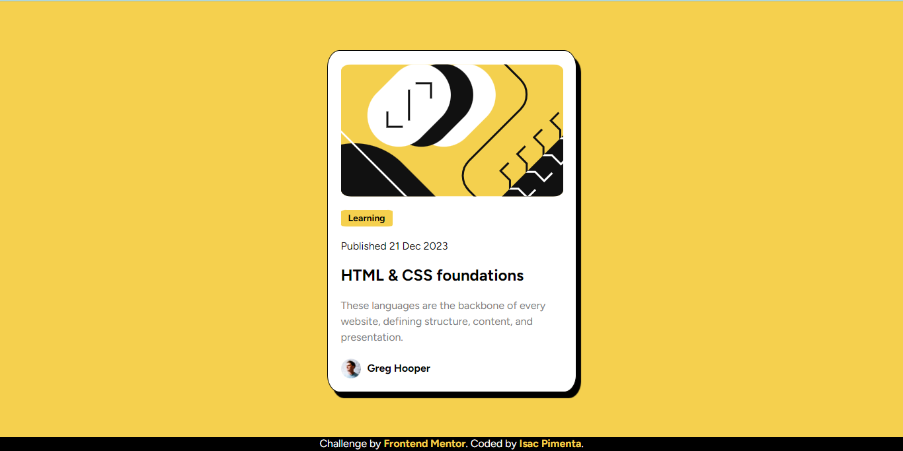

# Frontend Mentor - Blog preview card solution

This is a solution to the [Blog preview card challenge on Frontend Mentor](https://www.frontendmentor.io/challenges/blog-preview-card-ckPaj01IcS). Frontend Mentor challenges help you improve your coding skills by building realistic projects. 

## Table of contents

- [Overview](#overview)
  - [The challenge](#the-challenge)
  - [Screenshot](#screenshot)
  - [Links](#links)
- [My process](#my-process)
  - [Built with](#built-with)
  - [What I learned](#what-i-learned)
  - [Continued development](#continued-development)
  - [Useful resources](#useful-resources)
- [Author](#author)
- [Acknowledgments](#acknowledgments)

**Note: Delete this note and update the table of contents based on what sections you keep.**

## Overview

### The challenge

Users should be able to:

- See hover and focus states for all interactive elements on the page

### Screenshot



### Links

- Solution URL: [https://github.com/isacpimenta/Blog-preview-card]
- Live Site URL: [https://isacpimenta.github.io/Blog-preview-card/]

## My process

### Built with

- Semantic HTML5 markup
- CSS custom properties
- Flexbox 
- SVG
- External Text Fonts
- External CSS file

### What I learned

In general, I didn't have much difficulty with this challenge. However, one point to highlight is that I learned to attach the page footer to the end of the page.

Follow the example below:
```html
<footer class="attribution">
  Challenge by <a href="https://www.frontendmentor.io?ref=challenge" target="_blank">Frontend Mentor</a>.  
  Coded by <a target="_blank" href="https://github.com/isacpimenta">Isac Pimenta</a>.
</footer>
```
```css
footer{
  position: fixed;
  bottom: 0;
}
```

### Continued development

Currently I intend to focus on page responsiveness, and start learning Javascript

### Useful resources

- [ Discord ](https://discord.gg/CXfA2M6p) - The Frontend Mentor discord community helped me a lot when I was unsure about the page footer

## Author

- GitHub - [Isac Pimenta de Abreu](https://github.com/isacpimenta)
- Frontend Mentor - [@isacpimenta](https://www.frontendmentor.io/profile/isacpimenta)